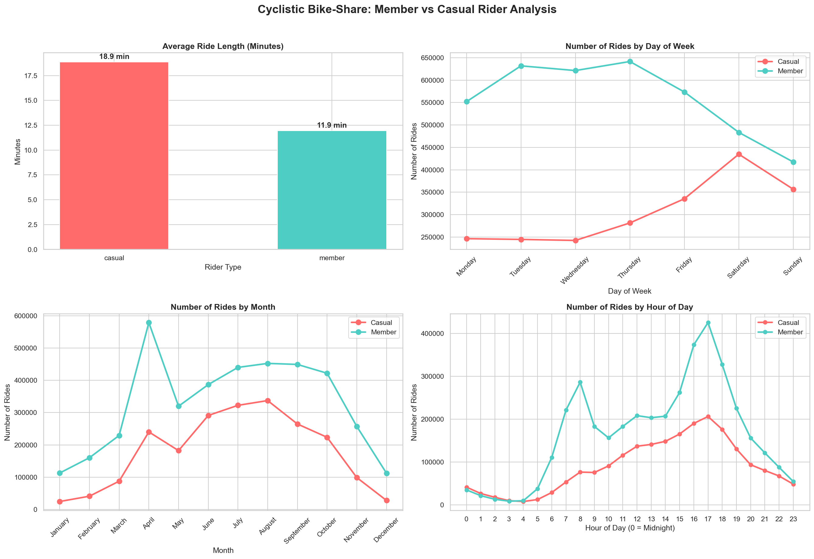

# 🚲 Cyclistic Bike-Share Analysis
### Google Data Analytics Professional Certificate — Capstone Project
**Author:** Robert Johnson

---

## 📋 Project Overview

This case study is the capstone project for the Google Data Analytics Professional Certificate. As a junior data analyst for the fictional bike-share company **Cyclistic**, I was tasked with answering the question:

> **"How do annual members and casual riders use Cyclistic bikes differently?"**

The goal was to uncover behavioral differences between the two rider groups and use those insights to design a data-driven marketing strategy to convert casual riders into annual members.

---

## 🛠️ Tools & Technologies

- **Python** — Primary analysis language
- **Pandas** — Data manipulation and cleaning
- **NumPy** — Numerical calculations
- **Matplotlib & Seaborn** — Data visualization
- **JupyterLab** — Development environment

---

## 📂 Project Structure

```
cyclistic_capstone/
├── notebooks/
│   └── cyclistic_analysis.ipynb   # Full analysis notebook
├── raw_data/                       # 12 months of raw trip CSVs
├── cyclistic_analysis.png          # Final visualization chart
└── analysis_summary.csv            # Exported summary statistics
```

---

## 📊 Dataset

- **Source:** [Divvy Trip Data](https://divvy-tripdata.s3.amazonaws.com/index.html) provided by Motivate International Inc.
- **License:** Public data made available under [this license](https://divvybikes.com/data-license-agreement)
- **Period:** 12 months of historical trip data
- **Size:** 6,068,796 rows across 13 columns
- **Note:** Data-privacy restrictions prevent connecting rides to personally identifiable information

---

## 🔄 Data Processing

### Cleaning Steps
- Converted `started_at` and `ended_at` columns to datetime format
- Removed rides with negative or zero ride length (data errors)
- Removed rides longer than 24 hours (likely abandoned bikes)
- Dropped rows with missing end coordinates (~6,162 rows removed)
- **Final clean dataset: 6,062,406 rows**

### Engineered Features
| Column | Description |
|---|---|
| `ride_length` | Duration of each ride in minutes |
| `day_of_week` | Day the ride started (e.g., Monday) |
| `month` | Month the ride started (e.g., July) |
| `hour` | Hour of day the ride started (0–23) |

---

## 🔍 Key Findings

### Finding 1: Usage Patterns
- **Members** ride primarily on **weekdays** — consistent with commuting behavior
- **Casual riders** ride primarily on **weekends** — consistent with leisure use
- Members show clear spikes at **8am and 5pm**; casuals build gradually through the day

### Finding 2: Ride Duration
- Casual riders average **18.87 minutes** per ride
- Members average **11.95 minutes** per ride
- Casuals ride **58% longer**, suggesting exploratory or leisure trips

### Finding 3: Seasonality
- Both groups peak in **summer (July/August)**
- Casual ridership nearly disappears in winter (28,004 rides in December vs 337,236 in August)
- Members maintain more consistent year-round usage

---

## 📈 Visualizations



*Four-panel visualization showing ride length comparison, rides by day of week, rides by month, and rides by hour of day — broken down by member vs casual rider type.*

---

## ✅ Top 3 Recommendations

**1. Weekend-to-Membership Conversion Campaign**
Launch targeted promotions at high-traffic docking stations on weekends. Offer a discounted first month of membership via QR code scan. Messaging: *"You already ride on weekends — why not save money all year?"*

**2. Seasonal Urgency Campaign**
Launch a spring membership drive in March–April as casual ridership begins climbing. Offer a summer promotion: *"Join before June and get your first month free."* This captures casual riders at the moment they return to the app.

**3. Ride Rewards Incentive Program**
Since casual riders take longer trips, introduce a rewards program where longer rides earn credits toward membership discounts. This directly bridges casual riding behavior toward annual membership commitment.

---

## 🚀 How to Run This Project

1. Clone this repository
2. Install dependencies:
   ```bash
   pip install pandas numpy matplotlib seaborn jupyter
   ```
3. Download 12 months of [Divvy trip data](https://divvy-tripdata.s3.amazonaws.com/index.html) into the `raw_data/` folder
4. Open JupyterLab and run `notebooks/cyclistic_analysis.ipynb`

---

## 📬 Contact

**Robert Johnson**
- GitHub: [your-github-username]
- LinkedIn: [your-linkedin-url]

---

*This project was completed as part of the [Google Data Analytics Professional Certificate](https://grow.google/certificates/data-analytics/) on Coursera.*
